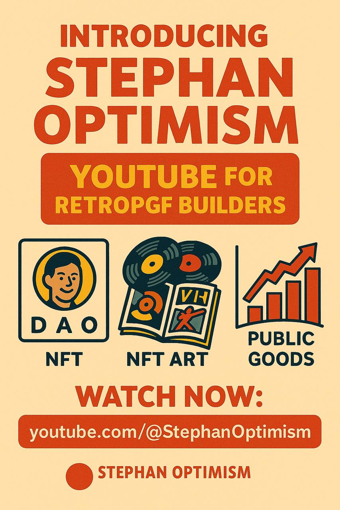

# BuildForGood YouTube OP Channel
📌 **This project is part of the BuildForGood ecosystem — a multi-project public goods initiative for Optimism.**  

An educational YouTube channel dedicated to Optimism.  
This channel is part of the BuildForGood ecosystem and focuses on spreading Optimism culture, RetroPGF awareness, and showcasing public goods projects in a simple and visual way.

## Value for Optimism
- 📺 Public good: Free educational and cultural videos for everyone.  
- 🌍 Explains Optimism, RetroPGF, and governance in accessible formats.  
- 🧩 Supports onboarding of new community members through video.  
- 🔴 Connects the BuildForGood ecosystem with the wider Optimism community.  

## Impact evidence
- Regular videos published with Optimism-focused content.  
- Views, likes, and comments show community engagement.  
- Used for onboarding newcomers and spreading Optimism awareness.  
- Showcases ecosystem projects (games, books, NFTs, cultural artifacts).  

## Links
- [YouTube Channel](youtube.com/@StephanOptimism)

## Preview

## 🌍 BuildForGood Ecosystem  
**This project is part of the BuildForGood Ecosystem for Optimism.**  

📖 Books & Articles • 🕹 Games • 🖼 NFTs & Memes • 🌍 Onchain Artifacts • 🎥 Media  

🔗 Explore the full ecosystem: [BuildForGood Ecosystem on Optimism Atlas](https://atlas.optimism.io/0xd349d01ca7247e321116767150902eb478c8d9d7b86b51cb9abc81c579fe39d5)
---
